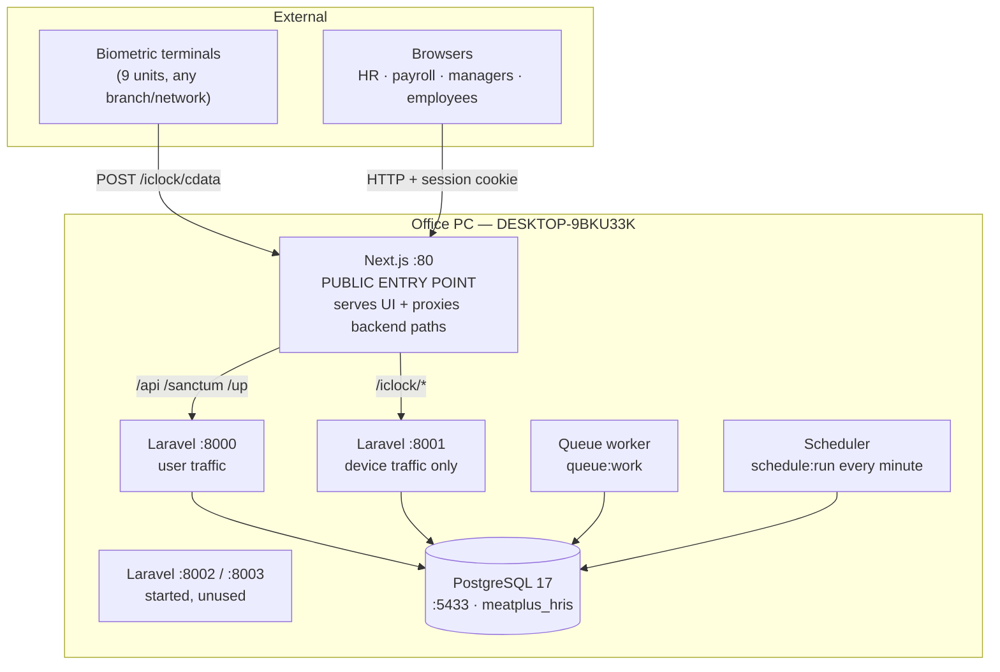
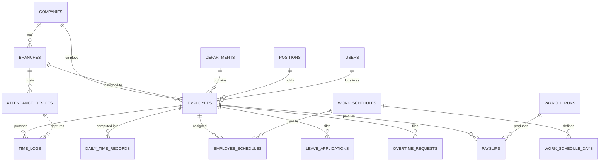
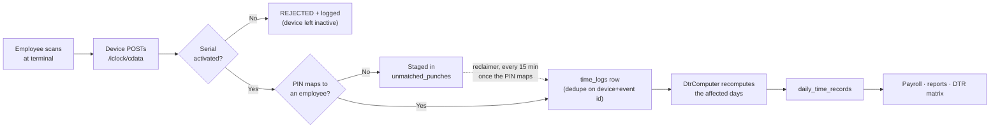
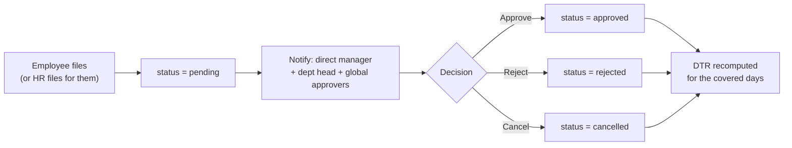
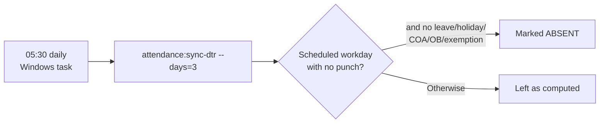
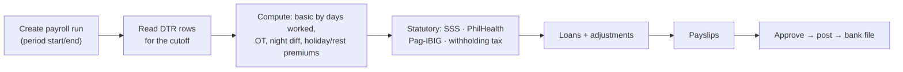
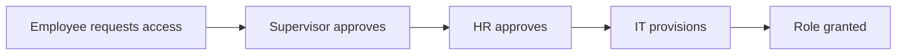

# ALL COMPANY HRIS — System Turnover & Technical Documentation

**Document purpose:** a complete technical description of the ALL COMPANY HRIS, sufficient to
maintain, troubleshoot, onboard a new developer, or hand the system over to another team
without access to the original authors.

| Field | Value |
|---|---|
| System name | ALL COMPANY HRIS (Meatplus HRIS) |
| Document version | 1.0 |
| Date prepared | 25 August 2026 |
| Status of system | **In production use, testing/rollout phase** — live attendance and payroll data; employee self-service login rollout not yet complete |
| Environment described | Self-hosted production on the office PC (`DESKTOP-9BKU33K`) |
| Repository | `https://github.com/itsmeyanxi/meatplus-hris` (branch `HRIS-STAGING`) |

> **How to keep this document true.** The code is the source of truth. Where this document and
> the code disagree, the code wins and this document is the thing to fix. Figures marked
> *(as of 25 Aug 2026)* are point-in-time counts, not fixed properties.

**Companion documents** (same folder): [00 System overview (plain English)](00-system-overview.md) ·
[01 Architecture](01-architecture.md) · [02 Database schema](02-database-schema.md) ·
[03 Permissions](03-permissions.md) · [04 Operations](04-operations.md) ·
[05 Biometric](05-biometric.md) · [06 Deployment & hosting](06-deployment-hosting.md) ·
[07 Employee accounts](07-employee-accounts.md) · [08 Backend walkthrough](08-backend-walkthrough.md) ·
[09 Alerts & notifications](09-alerts-and-notifications.md)

---

## 1. System overview and purpose

The ALL COMPANY HRIS is an in-house Human Resource Information System built to replace a paid
external service (Sprout Solutions). It is the company's single source of truth for **who
works here, when they worked, what leave they took, and what they are paid**, across multiple
legal entities, and it follows Philippine statutory rules (BIR, SSS, PhilHealth, Pag-IBIG,
DOLE).

**What it does**

| Area | Capability |
|---|---|
| Employee records | Full 201 file: personal, employment, dependents, education, government IDs, bank accounts, contracts, addresses, emergency contacts |
| Attendance | Biometric + web capture, work schedules, holidays, a DTR engine, corrections, and OT / undertime / official-business / certificate-of-attendance requests |
| Leave | Leave types, credit balances, filing and approval |
| Payroll | Semi-monthly computation with PH statutory deductions, loans, adjustments, payslips, bank file |
| Access control | Role-based permissions, multi-stage access requests, audit trail |
| Self-service | Employees see their own DTR, payslips, and file their own requests |

**Scale (as of 25 Aug 2026)**

| Metric | Count |
|---|---|
| Companies (tenants) | 7 |
| Branches | 31 |
| Employees (total / active) | 1,021 / 661 |
| User logins (total / active) | 83 / 82 |
| Biometric terminals | 9 |
| Attendance punches on record | 101,671 |
| Daily time records | 107,192 |
| Database size | 104 MB |

> 📷 **Screenshot 01** — the dashboard after login, showing the tenant switcher and summary
> cards. See [screenshots/README.md](screenshots/README.md).
>
> 

---

## 2. System architecture and technology stack

### 2.1 Technology stack

| Layer | Technology | Version |
|---|---|---|
| Frontend | Next.js (App Router), TypeScript, TanStack Query, Tailwind | Next 16.2 |
| Backend | Laravel (PHP), domain-driven layout, REST API | Laravel 11.53, PHP 8.3.30 |
| Database | PostgreSQL (self-hosted via Laragon) | PostgreSQL 17 |
| Authentication | Laravel Sanctum (cookie/session) + Spatie Permission (teams mode) | Sanctum 4.3, Permission 6.25 |
| Biometric | ZKTeco terminals, ADMS ("iclock") push protocol | — |
| Mail | Gmail SMTP, queued | — |
| Host OS | Windows 11 Pro | 10.0.26200 |

### 2.2 Runtime topology



**Why device traffic is separated.** `php artisan serve` handles **one request at a time**.
Routing punches to `:8001` and the UI to `:8000` means a burst of punches cannot block someone
loading a page, and a slow report cannot make a terminal time out.

**Why Next.js holds port 80.** Caddy was the original reverse proxy and load balancer.
Windows **Smart App Control** blocks the unsigned `tools\caddy.exe`, so `start-production.ps1`
sets `$useCaddy = $false` and Next.js serves port 80 directly, proxying backend paths through
`frontend/next.config.mjs`.

> ⚠️ **Known architectural consequence.** Without Caddy there is **no load balancing and no
> `/up` health-check failover**. Workers `:8002`/`:8003` start but receive no traffic. If the
> `:8000` worker dies, the UI is down until the pool is restarted. See §11.

### 2.3 Multi-tenancy

Company = tenant. Every tenant-scoped table carries `company_id`, and a global Eloquent scope
(`App\Domain\Identity\Scopes\CompanyScope`) filters **all** queries by the acting user's
`active_company_id`.

**This applies to everyone, including super admins.** There is no cross-tenant "god view" of
data; seeing another company's records requires explicitly switching companies. A role's
elevated power governs *what a user may do*, not *what data they see*. The scope **fails
closed** — a user with no active company sees nothing rather than everything.

The documented exception is a user's own notifications, which are keyed to the user rather
than to a company.

---

## 3. Database structure and key tables

**78 tables**, 113 migrations, PostgreSQL 17, database `meatplus_hris` on port 5433.
Full table-by-table detail is in [02-database-schema.md](02-database-schema.md); this section
covers the shape and the tables that matter most.

### 3.1 Core entity relationships



### 3.2 Largest / most important tables (as of 25 Aug 2026)

| Table | Rows | Size | Purpose |
|---|---:|---|---|
| `daily_time_records` | 107,192 | 24 MB | **The DTR.** One row per employee per day; the computed truth payroll reads |
| `time_logs` | 101,671 | 42 MB | Raw punches (biometric / web / manual). Append-only |
| `unmatched_punches` | 22,106 | 7.4 MB | Punches whose PIN matched no employee — staged, not lost (see §4.3) |
| `overtime_requests` | 20,414 | 5.5 MB | Filed and imported overtime |
| `leave_balances` | 5,521 | 1.9 MB | Leave credits per employee per type |
| `activity_log` | 3,336 | 1.5 MB | Audit trail (Spatie activitylog) |
| `employees` | 1,021 | 848 kB | The 201 file master record |
| `employee_data_issues` | 1,109 | 720 kB | Detected data-quality gaps for HR review |
| `notifications` | 496 | 344 kB | In-app bell items |
| `payslips` | 331 | 296 kB | Computed pay per employee per run |
| `users` | 83 | 120 kB | Login accounts |

### 3.3 Table groups

| Group | Tables |
|---|---|
| Identity & tenancy | `companies`, `branches`, `users`, `company_user`, `invitations`, `roles`, `permissions`, `model_has_roles`, `role_has_permissions` |
| HRIS | `employees`, `departments`, `positions`, `employment_types`, `employee_addresses`, `employee_government_ids`, `employee_bank_accounts`, `employee_dependents`, `employee_education`, `employee_emergency_contacts`, `employee_contracts`, `employee_data_issues` |
| Attendance | `time_logs`, `daily_time_records`, `work_schedules`, `work_schedule_days`, `employee_schedules`, `shift_adjustments`, `holidays`, `attendance_devices`, `unmatched_punches`, `biometric_anomalies`, `overtime_requests`, `undertime_requests`, `official_business_requests`, `certificate_of_attendance_requests`, `attendance_corrections`, `time_log_requests` |
| Leave | `leave_types`, `leave_balances`, `leave_applications` |
| Payroll | `payroll_runs`, `payslips`, `employee_compensations`, `employee_payroll_profiles`, `employee_loans` |
| Platform | `notifications`, `jobs`, `failed_jobs`, `activity_log`, `sessions`, `cache`, `migrations` |

### 3.4 Data rules that must not be broken

1. **Money is `DECIMAL`/`NUMERIC`, never float.**
2. **Government IDs and bank account numbers are encrypted at rest** via Eloquent casts. Never
   raw-insert into those columns with SQL — reads will fail with a decryption error. Always go
   through the model or `Crypt`.
3. **Punches dedupe on `(device_id, source_event_id)`** — this is what makes device replays
   harmless.
4. **`daily_time_records` is derived**, not entered. It is recomputed from punches, schedules,
   holidays, leave and approved requests. The exception is a row with `status = 'locked'`,
   which an approved attendance correction has pinned and the engine will not overwrite.
5. **Never run `db:seed` or `migrate:fresh` against the production database.** It can wipe or
   duplicate live records. Use `php artisan migrate:status` to inspect pending work.

---

## 4. Application modules and functionalities

**89 frontend pages** across the modules below; **234 API routes**; 6 backend domains.

### 4.1 Module map

| Module | Frontend route(s) | Backend domain | What it does |
|---|---|---|---|
| Dashboard | `/dashboard` | — | Summary cards, pending approvals, quick actions |
| Employees | `/employees`, `/employee-registration` | `HRIS` | 201 file CRUD, import/export, data-issue review |
| Attendance | `/attendance/*` | `Attendance` | DTR matrix, time logs, schedules, holidays, uploads, biometric issues |
| Attendance requests | `/attendance/requests/*`, `/overtimes`, `/undertimes`, `/official-businesses`, `/certificates-of-attendance`, `/schedule-adjustments` | `Attendance` | File / approve OT, UT, OB, COA, corrections |
| Leave | `/leaves` | `Leave` | Types, balances, applications, approval |
| Payroll | `/reports`, `/my-payslips` | `Payroll` | Runs, payslips, statutory computation, bank file |
| Devices | `/devices` | `Attendance` | Terminal registry + connection health report |
| Agencies | `/agencies`, `/crews`, `/agency-geofence` | `HRIS` | Agency / project-crew workers, kept out of the organic attendance module |
| Access control | `/access-levels`, `/access-requests`, `/request-access`, `/users` | `AccessControl`, `Identity` | Roles, permissions, multi-stage access requests |
| Self-service | `/my-attendance`, `/my-time-logs`, `/my-payslips`, `/my-team`, `/account` | multiple | What an ordinary employee sees |
| Audit | `/audit-trail` | — | Who changed what, with readable diffs and export |
| Master data | `/companies`, `/branches`, `/work-locations`, `/asset-types`, `/benefit-types`, `/visa-types` | `Identity`, `HRIS` | Reference tables |

> 📷 **Screenshots 02–06** — one per major module. Capture guide, including what must be
> redacted: [screenshots/README.md](screenshots/README.md).

**Employee list** — 201 file records, import/export, data-issue review:


**DTR matrix** — the computed daily record, colour-coded by day state:


**Time logs** — raw punches, filterable by device, company and department:


**Payslip** — semi-monthly computation output:


**Biometric connection report** — terminal health, and the *Last contact* vs *Last punch*
distinction described in §4.3:


### 4.2 The three engines

Most of the system is CRUD. Three pieces carry real logic and deserve attention during
handover:

| Engine | File | Responsibility |
|---|---|---|
| **DTR computer** | `backend/app/Domain/Attendance/Services/DtrComputer.php` | Turns raw punches + schedule + holiday + leave + approved requests into one daily record. ~650 lines, the most consequential file in the system |
| **Payroll computer** | `backend/app/Domain/Payroll/Services/PayrollComputer.php` | Semi-monthly pay from DTR rows + compensation + statutory tables + loans |
| **ADMS ingestion** | `backend/app/Domain/Attendance/Services/Biometric/AdmsIngestionService.php` | Receives device pushes, maps PIN → employee, stores punches idempotently, triggers recompute |

### 4.3 Attendance capture: the full path



**Nothing is silently discarded.** An unknown PIN is *staged*, and
`attendance:reclaim-unmatched` converts it into a real punch the moment that PIN maps to
somebody — then recomputes the affected DTRs.

---

## 5. System workflows and process flow

### 5.1 Attendance request approval (OT / UT / OB / COA / correction)



**Rules enforced in code** (`HandlesApprovalWorkflow`):

- `attendance.manage` may file for anyone; everyone else files only for themselves.
- **Nobody may approve their own request**, at any permission level.
- `attendance.approve.any` approves anything; `attendance.approve.self_dept` approves only
  direct reports or members of a department they head.
- A decision can be **reverted** to pending by the same authority that could approve it.
- Every decision recomputes the DTR immediately — approvals never wait for a nightly job.

### 5.2 Daily attendance close-out



Only days that have **fully elapsed** are judged — today and future dates are never marked
absent. Employees with no work schedule (contractual staff) are never absence-tracked.

### 5.3 Payroll run



Basic pay is driven by **days**, not hours: monthly-paid staff are prorated by
`paid days ÷ scheduled days`; daily-paid staff by `rate × days worked`.

### 5.4 Access request (multi-stage)



---

## 6. User roles and access permissions

**18 roles, 34 permissions.** Roles are assigned **per company** (Spatie teams mode, team =
`company_id`), so the same person can be HR in one entity and nothing in another. Full
glossary in [03-permissions.md](03-permissions.md).

### 6.1 Role hierarchy

```
super_admin   ← god mode; full system authority
   └─ it_admin    ← full technical authority; global for permissions purposes
        └─ admin      ← company-level administrator
             └─ hr_confi / hr_admin / payroll_officer   ← sensitive data + payroll
                  └─ hr_officer / hr_coordinator / timekeeper
                       └─ dept_head / supervisor / team_lead   ← approve for their people
                            └─ employee   ← self-service only
```

### 6.2 Roles in use (as of 25 Aug 2026)

| Role | Users | Permissions | Purpose |
|---|---:|---:|---|
| `super_admin` | 1 | 33 | Full authority |
| `it_admin` | 3 | 33 | Technical administration |
| `admin` | 4 | 30 | Company administrator |
| `hr_confi` | 3 | 19 | HR with confidential/sensitive access |
| `hr_admin` | 3 | 18 | HR administration |
| `hr_officer` | 6 | 14 | Day-to-day HR |
| `payroll_officer` | 2 | 12 | Payroll processing |
| `supervisor` | 6 | 8 | Approve for direct reports |
| `dept_head` | 1 | 8 | Approve for the department |
| `it_staff` | 1 | 8 | Technical support |
| `hr_coordinator` | 4 | 7 | HR support |
| `timekeeper` | 3 | 6 | Attendance entry/correction |
| `employee` | 80 | 1 | Self-service only |
| `garahe_teamlead`, `dept_admin`, `team_lead`, `transport_access`, `sales_employee` | 0 | 2–8 | Defined, not yet assigned |

### 6.3 Permission catalogue (34)

| Domain | Permissions |
|---|---|
| Employee | `employee.view`, `employee.create`, `employee.update`, `employee.delete`, `employee.view.sensitive` |
| Attendance | `attendance.view`, `attendance.view.any`, `attendance.manage`, `attendance.correct`, `attendance.approve.any`, `attendance.approve.self_dept` |
| Leave | `leave.view`, `leave.file`, `leave.manage_types`, `leave.approve.any`, `leave.approve.self_dept` |
| Payroll | `payroll.view`, `payroll.run`, `payroll.approve`, `payroll.post`, `compensation.view`, `compensation.manage` |
| Access requests | `access_request.view`, `access_request.approve.supervisor`, `access_request.approve.hr`, `access_request.approve.it` |
| Platform | `user.manage`, `user.invite`, `role.manage`, `company.manage`, `device.manage`, `audit.view`, `gov_report.view`, `gov_report.generate` |

**`PermissionsSeeder.php` is the RBAC source of truth.** After any role or permission change,
run `php artisan permission:cache-reset` or the change will not take effect.

> 📷 **Screenshot 07** — the Access Levels page showing the role × permission matrix.
>
> 

---

## 7. API and integration details

### 7.1 API surface

- **Base:** `/api/v1`, 234 routes, REST, JSON.
- **Auth:** Laravel Sanctum **cookie/session** (not bearer tokens). The browser calls
  `GET /sanctum/csrf-cookie`, then `POST /api/v1/login`; subsequent requests carry the session
  cookie.
- **Same-origin by design:** the frontend proxies `/api` server-side, so the browser only ever
  sees one origin. That keeps the session cookie same-origin — **no CORS configuration and no
  `SameSite=None` is required**, and none should be added.
- **Rate limiting:** `throttle:api` on all API routes; login has stricter brute-force limits.
- **Session:** 15-minute inactivity auto-sign-out in the browser; `SESSION_LIFETIME=120`
  minutes server-side.

Representative endpoints:

| Method | Endpoint | Purpose |
|---|---|---|
| `POST` | `/api/v1/login` | Authenticate |
| `GET` | `/api/v1/employees` | List employees (company-scoped) |
| `GET` | `/api/v1/daily-time-records` | DTR matrix |
| `GET` | `/api/v1/daily-time-records/export` | DTR as CSV |
| `GET` | `/api/v1/time-logs` | Raw punches + OB/COA/OT events |
| `POST` | `/api/v1/overtime-requests/{id}/approve` | Approve OT |
| `GET` | `/api/v1/attendance-devices/report` | Biometric connection health |
| `GET` | `/api/v1/my/notifications` | Bell items for the current user |
| `GET` | `/api/v1/reports/dtr` | Payroll-oriented DTR report |

### 7.2 External integrations

| Integration | Direction | Protocol | Notes |
|---|---|---|---|
| **ZKTeco biometric terminals** | Inbound (device → server) | ADMS / "iclock" HTTP push | 9 units. Unauthenticated route, protected by a **serial allowlist**. Devices poll every ~30s |
| **Hikvision terminals** | Outbound (server → device) | ISAPI pull | `HikvisionIsapiClient`; polled by `attendance:sync-biometric` |
| **Gmail SMTP** | Outbound | SMTP/TLS :587 | Queued mail. Sends as `mtchovictoria@gmail.com` |
| **Supabase (PostgreSQL)** | Outbound | pg | Off-site nightly backup target only — **not** a live data source |
| **Microsoft Graph mail** | — | — | Transport is built but **dormant**; switch with `MAIL_MAILER=microsoft-graph` |

> The ADMS endpoints (`routes/iclock.php`) run with **no middleware at all** — no CSRF, no
> session, no auth. This is required by the protocol; see §14 for why it is safe.

---

## 8. Configuration and deployment procedures

### 8.1 Configuration files

| File | Contains | In git? |
|---|---|---|
| `backend/.env.production` | **The live config.** DB, mail, session, queue, app URL | **No** — secrets |
| `backend/.env` | Copy activated by `start-production.ps1` | No |
| `frontend/next.config.mjs` | Backend proxy targets (`BACKEND_URL`, `DEVICE_BACKEND_URL`) | Yes |
| `Caddyfile` | Reverse proxy config — **not active** | Yes |

> ⚠️ **`APP_ENV=production` makes Laravel read `.env.production`, not `.env`.** Editing `.env`
> appears to do nothing. Edit `.env.production`, then `php artisan config:cache`.

Key settings (values redacted — read them from the file on the host):

```
APP_ENV=production          APP_DEBUG=false
APP_URL=http://allcompanyhris.meatplus.ph
DB_CONNECTION=pgsql         DB_HOST=127.0.0.1   DB_PORT=5433   DB_DATABASE=meatplus_hris
QUEUE_CONNECTION=database   SESSION_DRIVER=file  SESSION_LIFETIME=120
SANCTUM_STATEFUL_DOMAINS=allcompanyhris.meatplus.ph
MAIL_MAILER=smtp            MAIL_HOST=smtp.gmail.com   MAIL_PORT=587
SESSION_SECURE_COOKIE=false   # must become true when HTTPS is enabled
```

### 8.2 Starting the system

```powershell
.\start-production.ps1
```

Starts PostgreSQL (if down), activates the production env, caches config + routes, launches
the 4 backend workers, starts the queue-worker watchdog, and starts Next.js on port 80.
`\register-autostart.ps1` makes this run at logon.

### 8.3 Deploying a change

| Change | Procedure |
|---|---|
| **Backend PHP** | Save the file — live on the next request (each `artisan serve` request boots fresh). No restart |
| **Backend config / routes / permissions** | `php artisan config:cache`, `route:cache`, `permission:cache-reset` |
| **Database** | `php artisan migrate --force` — code being live does **not** apply migrations |
| **Frontend** | `.\deploy-frontend.ps1` — shows a maintenance page on port 80 during the rebuild, then restarts Next |
| **Version control** | Commit and push to `HRIS-STAGING` |

> Do **not** build the frontend by hand. `npm run build` alone leaves port 80 dead for several
> minutes, which users see as a browser error rather than a maintenance notice.

### 8.4 First-time setup on a new machine

1. Install **Laragon** (PHP 8.3, Node, PostgreSQL 17). Enable `pdo_pgsql`, `pgsql`, `zip`.
2. `cd backend && composer install`; `cd frontend && npm ci`.
3. Create `backend/.env.production` (DB, mail, app URL).
4. `php artisan migrate` then `php artisan db:seed` — **empty database only**.
5. `npm run build`, then `.\start-production.ps1`.
6. Install the timers — **without these nothing recurring runs**:
   `.\tools\install-scheduler.ps1` and `.\tools\install-frontend-watchdog.ps1`.

---

## 9. Server and environment requirements

### 9.1 Current production host

| Item | Value |
|---|---|
| Hostname | `DESKTOP-9BKU33K` |
| OS | Windows 11 Pro 10.0.26200 |
| CPU | Intel Core i5-7400 @ 3.00 GHz (4C / 4T) |
| RAM | 31.9 GB (≈17 GB free in normal operation) |
| Storage | 930 GB total, ≈128 GB used |
| LAN IP | `192.168.125.53` (static) |
| Public IP | `202.175.255.85` (static) |
| Public hostname | `allcompanyhris.meatplus.ph` (DNS A record) |

### 9.2 Minimum requirements to run this system elsewhere

| Resource | Minimum | Notes |
|---|---|---|
| CPU | 4 cores | 4 PHP workers + Node + Postgres |
| RAM | 8 GB | 16 GB comfortable |
| Disk | 50 GB | DB is small (104 MB); `iclock.log` growth is the real consumer (§11) |
| PHP | 8.2+ | 8.3 in use; needs `pdo_pgsql`, `pgsql`, `zip` |
| Node | 20+ | 24.18 in use |
| PostgreSQL | 14+ | 17 in use. The code also runs on MySQL |
| Network | Static IP or dynamic DNS; inbound TCP 80 | Terminals must reach the server |

### 9.3 Ports

| Port | Bound to | Purpose | Exposed publicly? |
|---|---|---|---|
| 80 | Next.js | Public entry point | **Yes** (router forward) |
| 8000 | Laravel | User API | LAN only |
| 8001 | Laravel | Device pushes | LAN only |
| 8002–8003 | Laravel | Started, unused | LAN only |
| 5433 | PostgreSQL | Database | **No — must never be forwarded** |

### 9.4 Power and continuity

The PC and router should be on a **UPS**. A power cut takes the entire service down, can leave
PostgreSQL with an unclean shutdown, and — because absence is judged from missing punches —
means terminals that cannot reach the server generate absences for their staff.

---

## 10. Backup and recovery procedures

### 10.1 What runs automatically

| Backup | When | Where | Task name |
|---|---|---|---|
| Local `pg_dump` | Daily 22:00 | `.\backups\` (gitignored) | *Meatplus HRIS DB Backup* |
| Off-site copy | Daily 22:30 | Supabase (cloud PostgreSQL) | *Meatplus HRIS Supabase Offsite Backup* |
| Data archive | Daily 23:00 | Local | *Meatplus HRIS Data Archive* |

Verify they are healthy:

```powershell
Get-ScheduledTaskInfo -TaskName "Meatplus HRIS DB Backup"        # Result 0 = success
Get-ScheduledTaskInfo -TaskName "Meatplus HRIS Supabase Offsite Backup"
```

### 10.2 Manual backup

```powershell
.\backup-db.ps1                 # timestamped dump into .\backups\
.\backup-db.ps1 -KeepDays 14    # also prune dumps older than 14 days
.\backup-to-supabase.ps1        # off-site copy
```

**Always take a manual dump before a migration or any bulk data operation.**

### 10.3 Restore

```powershell
& "C:\laragon\bin\postgresql\pgsql\bin\psql.exe" -p 5433 -U postgres -d meatplus_hris -f .\backups\<dump>.sql
```

### 10.4 Recovery scenarios

| Scenario | Recovery |
|---|---|
| Database down after a power cut | `.\start-production.ps1`, or start Postgres by hand: `pg_ctl.exe start -D "C:\laragon\data\postgresql-17" -o "-p 5433"` |
| Data corrupted / bad bulk operation | Restore the most recent dump from `.\backups\`; expect to lose changes since 22:00 |
| Whole machine lost | Rebuild per §8.4, restore the Supabase off-site copy, re-register the biometric device serials, re-point DNS if the IP changed |
| A terminal was offline for days | Reconnect it — ZKTeco units buffer punches and upload them on reconnect; the DTR recomputes automatically |

> **Test your restores.** An untested backup is not a backup. Restore into a scratch database
> periodically and confirm row counts.

---

## 11. Troubleshooting and known technical issues

### 11.1 Common problems

| Symptom | Cause | Fix |
|---|---|---|
| Site not loading | Next.js (port 80) down | `.\start-production.ps1`; the Frontend Watchdog task should self-heal within a minute |
| API failing, site loads | `:8000` worker died — **nothing routes around it** | Restart the pool |
| Frontend change not visible | Not rebuilt | `.\deploy-frontend.ps1` |
| Role/permission change has no effect | Cached | `php artisan permission:cache-reset` |
| Config change has no effect | Edited `.env` instead of `.env.production`, or didn't re-cache | Edit `.env.production`, `php artisan config:cache` |
| Emails not arriving | Queue worker down (mail is queued, not inline) | Check for a `queue:work` process; `select count(*) from failed_jobs;` |
| Nothing recurring is running | Scheduler task not firing | `Get-ScheduledTaskInfo -TaskName "Meatplus HRIS Scheduler"` — `Result` must be 0 |
| Login fails with CSRF/419 | Stale browser cache, or `SANCTUM_STATEFUL_DOMAINS` doesn't match the browsed host | Hard refresh; check the env value |
| Terminal shows "Unsupported SSL request" | Device trying HTTPS | Device menu → Cloud Server: **Enable HTTPS = OFF** |
| Punches arrive but match nobody | PINs not mapped | Set each employee's **Biometric ID** to their device PIN; the reclaimer recovers the backlog |

### 11.2 Known open issues

Recorded honestly so the next maintainer is not surprised. Ranked by impact.

| # | Issue | Impact | Status |
|---|---|---|---|
| 1 | **DTR phantom time-ins.** A mutable-Carbon bug in `DtrComputer` fabricated a time-in exactly 16 hours after the real punch and dropped the time-out. **4,043 rows across 243 employees, Oct 2025 – Aug 2026.** All lost night-differential; 592 rest-day + 53 holiday days earned no premium | Payroll under-credit for night-shift staff | **Open** — fix identified (`$actualIn->copy()`), needs the fix plus a backfill recompute |
| 2 | **15,000+ staged punches.** Mostly PASEI terminal `TTQ5250700211` (239 unmapped PINs, ~12,000 punches) | Attendance never reached those employees' DTRs | **Open** — needs the PINs mapped to employees |
| 3 | **Demo company blocks punch reclamation.** ~680 real punches across 16 PINs cannot be reclaimed because a sandbox employee (company 9) shares the PIN, which the reclaimer treats as ambiguity | Real attendance stuck in staging | **Open** — exclude the sandbox company / inactive employees from the uniqueness index |
| 4 | **Punch-exempt staff credited future hours.** No "day has elapsed" guard on the punch-exempt branch; ~107 future-dated DTR rows already carry hours | Payroll could book unworked days | **Open** |
| 5 | **14% of punch days credit zero hours.** 569 in-without-out + 149 out-without-in in Aug 2026 across 267 employees; nothing queues these for HR to chase | Silent under-credit | **Open** |
| 6 | **No load balancer / failover.** Caddy blocked by Smart App Control | A dead `:8000` takes the UI down | **Open** — needs a signed Caddy build, or Cloudflare Tunnel |
| 7 | **`iclock.log` grows unbounded.** 119 MB and rising; terminals log every ~30s poll, no rotation | Disk consumption; file impractical to open | **Open** |
| 8 | **No notification retention.** `notifications` only grows; 381 unread at time of writing | Clutter | **Open** |
| 9 | **HTTPS not enabled.** Browser geolocation features (geofenced web check-in) are unavailable on an insecure origin | Feature unavailable | **Deliberate**, see §14 |
| 10 | **Laravel 11 → 12 upgrade** outstanding | Maintenance debt | **Open** |
| 11 | **Approved undertime requests have no DTR effect.** `DtrComputer` never reads `UndertimeRequest` | Workflow may be decorative | **Needs a business decision** |
| 12 | **Demo seed punches (`DEMO-DEV-1`)** sit inside real 2026 date ranges | Queries filtering by date alone pick up fake punches | **Known** — always filter attendance by `device_id` |

---

## 12. Source code structure and dependencies

### 12.1 Repository layout

```
meatplus-hris/
├─ backend/                     Laravel 11 API
│  ├─ app/
│  │  ├─ Domain/                ← business logic lives HERE, not in controllers
│  │  │  ├─ Identity/           Company, Branch, User, CompanyScope
│  │  │  ├─ HRIS/               Employee + org structure
│  │  │  ├─ Attendance/         TimeLog, DTR, schedules, devices, requests
│  │  │  ├─ Leave/              Types, balances, applications
│  │  │  ├─ Payroll/            Runs, payslips, statutory computation
│  │  │  └─ AccessControl/      Access request workflow
│  │  ├─ Http/Controllers/Api/V1/   REST controllers (thin)
│  │  ├─ Http/Requests/         FormRequest validation + authorize()
│  │  ├─ Http/Resources/        API response shaping
│  │  ├─ Console/Commands/      Artisan commands (11)
│  │  └─ Notifications/         Bell + email notifications
│  ├─ routes/api.php            234 routes, /api/v1
│  ├─ routes/iclock.php         ADMS device endpoints (NO middleware)
│  ├─ routes/console.php        ← the scheduler; every recurring job
│  └─ database/migrations/      113 migrations
├─ frontend/                    Next.js 16 (App Router)
│  ├─ src/app/(admin)/          89 pages, one folder per module
│  ├─ src/components/           Shared UI
│  ├─ src/lib/                  API clients, typed
│  └─ next.config.mjs           ← backend proxy targets
├─ docs/                        This documentation
├─ tools/                       Scheduler/watchdog installers, maintenance page
├─ backups/                     DB dumps (gitignored)
└─ *.ps1                        Operational scripts
```

### 12.2 Dependencies

**Backend (`composer.json`)** — deliberately small:

| Package | Version | Purpose |
|---|---|---|
| `php` | ^8.2 | Runtime |
| `laravel/framework` | ^11.0 | Framework |
| `laravel/sanctum` | ^4.3 | Cookie/session auth |
| `spatie/laravel-permission` | ^6.25 | RBAC, teams mode |
| `spatie/laravel-activitylog` | ^4.12 | Audit trail |
| `openspout/openspout` | ^5.3 | XLSX/CSV import + export |
| `laravel/tinker` | ^2.9 | REPL |

**Frontend (`package.json`)**:

| Package | Version | Purpose |
|---|---|---|
| `next` | ^16.2.6 | Framework |
| `react` / `react-dom` | ^18 | UI |
| `@tanstack/react-query` | ^5.100 | Server state / caching |
| `axios` | ^1.16 | HTTP client |
| `react-hook-form` + `@hookform/resolvers` | ^7.76 / ^5.2 | Forms |
| `zod` | ^4.4 | Schema validation |
| `sonner` | ^2.0 | Toasts |

### 12.3 Conventions a new developer must follow

1. **Business logic goes in `app/Domain/*`,** not controllers. Controllers validate, authorize,
   delegate, and shape a response.
2. **Authorization lives in FormRequest `authorize()` or an explicit `abort_unless`.** Never
   rely on the UI hiding a button.
3. **Never bypass `CompanyScope`** except deliberately, with a comment saying why
   (`withoutGlobalScopes()` appears where cross-company resolution is genuinely required, e.g.
   notifying a cross-company manager).
4. **Frontend dropdowns use `SearchSelect` / `EmployeeSearchSelect`,** not raw `<select>`.
5. **Times are Asia/Manila.** Attendance is stored as Manila wall-clock and serialized with a
   `Z` suffix; the frontend must render with `timeZone: "Asia/Manila"` and must never slice a
   raw ISO string.
6. **Repo convention:** commit and push to `HRIS-STAGING`.

---

## 13. Scheduled jobs, background processes, and integrations

Two layers. **Laravel's scheduler** owns application jobs and is driven by one Windows task
running `php artisan schedule:run` every minute. A few **Windows tasks** sit outside Laravel.

### 13.1 Laravel scheduled jobs (`backend/routes/console.php`)

| Job | Cadence | Purpose |
|---|---|---|
| `attendance:sync-biometric` | every 5 min | Pull punches from polled (Hikvision) terminals |
| `attendance:reclaim-unmatched` | every 15 min | Convert staged unmatched punches once a PIN maps |
| `attendance:detect-biometric-anomalies` | hourly | Detect PIN-reuse collisions (**detection only**) |
| `attendance:biometric-digest` | daily 07:00 | The daily biometric notice to IT + HR |
| `employees:detect-data-issues` | hourly | Scan for employee-data gaps (**detection only**) |
| `employees:detect-data-issues --notify` | daily 07:05 | Send the data-issues digest |

Verify with `php artisan schedule:list`.

### 13.2 Windows Scheduled Tasks

| Task | Cadence | Purpose |
|---|---|---|
| *Meatplus HRIS Scheduler* | every 1 min | `php artisan schedule:run` — drives the table above |
| *Meatplus HRIS Frontend Watchdog* | every 1 min | Restart Next.js if port 80 stops answering |
| *Meatplus HRIS Attendance Closeout* | daily 05:30 | `attendance:sync-dtr --days=3` — marks absences |
| *Meatplus HRIS DB Backup* | daily 22:00 | Local `pg_dump` |
| *Meatplus HRIS Supabase Offsite Backup* | daily 22:30 | Off-site DR copy |
| *Meatplus HRIS Data Archive* | daily 23:00 | Archive sweep |
| *Meatplus HRIS Autostart* | at logon | `start-production.ps1` |

> ⚠️ **The attendance close-out runs OUTSIDE the Laravel scheduler.** If you are investigating
> why absences did or didn't appear, look at the Windows task, not `routes/console.php`.

> 📷 **Screenshot 16** — Task Scheduler filtered to the *Meatplus HRIS* tasks, showing Status
> and Last Run Result. This is the fastest way for a new maintainer to confirm the automation
> is alive.
>
> 

### 13.3 Long-running background processes

| Process | Purpose | Supervision |
|---|---|---|
| `php artisan queue:work` | Sends queued mail | `queue-worker-keepalive.ps1 -Watch` restarts it |
| `next start` (port 80) | Serves the app | Frontend Watchdog task |
| 4 × `php artisan serve` | API + device endpoints | None — restart via `start-production.ps1` |

### 13.4 Alerting

Problems the system finds are reported as **one daily digest per person at 07:00** (bell
always; email **Mondays and Fridays only**), while requests needing a human decision are
notified instantly. Rationale and full detail: [09-alerts-and-notifications.md](09-alerts-and-notifications.md).

---

## 14. Security and access considerations

### 14.1 Controls in place

| Control | Implementation |
|---|---|
| Authentication | Sanctum cookie/session; same-origin (no CORS, no `SameSite=None`) |
| Authorization | Spatie Permission, teams mode, enforced in FormRequests / controllers |
| Tenant isolation | `CompanyScope` global scope on every tenant table; **fails closed** |
| Encryption at rest | Government IDs and bank account numbers encrypted via Eloquent casts |
| Brute-force protection | Rate limiting on login; `throttle:api` on all API routes |
| Device authorisation | **Serial allowlist** — unknown terminals auto-register *inactive* and their punches are rejected and logged |
| Audit trail | `spatie/laravel-activitylog` → `/audit-trail` with readable diffs and export |
| Session hygiene | 15-minute browser inactivity sign-out |
| Secrets | Live only in `.env.production`, never in git |
| Database exposure | PostgreSQL bound to localhost, port 5433 **not** forwarded |
| Production errors | `APP_DEBUG=false` — no stack traces to users |

### 14.2 Why the unauthenticated `/iclock` endpoint is safe

The ADMS protocol has no authentication, so `routes/iclock.php` runs with no middleware. It is
protected by the **serial allowlist**: a terminal that contacts the server for the first time
is registered as **inactive**, and its punches are **rejected and logged** until an
administrator activates that serial and assigns it a company. A forged push from an unknown
device therefore cannot inject attendance.

### 14.3 Accepted risks / open security items

| Item | Status |
|---|---|
| **HTTP only, no TLS** | Deliberate. Traffic is unencrypted; browser geolocation features are consequently unavailable. Enabling HTTPS needs either a signed Caddy build or a Cloudflare Tunnel (§6 of [06-deployment-hosting.md](06-deployment-hosting.md)) |
| `/iclock` reachable from the internet | Accepted — mitigated by the serial allowlist. Firewalling it to known source IPs was identified as a hardening step and is **not yet done** |
| Laravel 11 → 12 upgrade | Outstanding |
| Tenant-scope audit | Identified in the 14 Aug 2026 security review as not yet completed |
| Mail credentials in `.env.production` | Standard practice, but the file must never be committed or copied off the host |

### 14.4 On turnover — credentials to rotate

Anyone taking over should rotate, at minimum: the PostgreSQL `postgres` password, the Gmail
SMTP app password, `APP_KEY` (**note:** rotating `APP_KEY` makes existing encrypted government
IDs and bank numbers unreadable — plan a re-encryption before doing this), and GitHub
repository access.

---

## 15. System maintenance procedures

### 15.1 Routine cadence

| Frequency | Task |
|---|---|
| **Daily** | Read the 07:00 biometric digest. Confirm the previous day's DTRs closed (absences look sane) |
| **Weekly** | Check the connection report for offline terminals and low match rates. Review staged unmatched punches. Confirm backup tasks show `Result 0` |
| **Monthly** | Restore a backup into a scratch DB and verify. Check disk space (`iclock.log`). Review `failed_jobs`. Review open `employee_data_issues` |
| **Per payroll cutoff** | Reconcile DTR totals before running payroll; confirm no unresolved corrections for the period |
| **Quarterly** | `composer update` / `npm update` with testing. Review roles and user access. Prune old backups |
| **Annually** | Load the next year's Philippine holidays for **every** company. Review statutory tables (SSS/PhilHealth/Pag-IBIG/BIR) for rate changes |

### 15.2 Health check commands

```powershell
# Is everything listening?
Get-NetTCPConnection -State Listen | Where-Object { $_.LocalPort -in 80,5433,8000,8001 }

# Are the timers alive? (Result must be 0)
Get-ScheduledTask | Where-Object { $_.TaskName -like 'Meatplus*' } | Get-ScheduledTaskInfo

# Laravel side
cd backend
php artisan schedule:list
php artisan migrate:status
```

```sql
-- Is attendance flowing today?
select count(*) punches, count(distinct employee_id) people
from time_logs where logged_at::date = current_date;

-- Anything stuck?
select count(*) from unmatched_punches where reclaimed_at is null;
select count(*) from failed_jobs;
select count(*) from biometric_anomalies where resolved_at is null;
```

### 15.3 Before any risky change

1. Take a manual dump (`.\backup-db.ps1`).
2. Confirm what a migration will do (`php artisan migrate:status`).
3. Make the change on a branch, push to `HRIS-STAGING`.
4. Verify attendance still flows (punches arriving, DTRs computing) before considering it done.

---

## 16. Technical contacts and ownership

> ⚠️ **This section must be completed by management before the document is issued as a formal
> turnover.** The technical facts above were verified against the running system; the
> people and commercial details below were not, and must not be guessed.

| Role | Name | Contact | Responsibility |
|---|---|---|---|
| System owner (business) | *(to be filled)* | | Accountable for the system; approves changes |
| Primary developer / maintainer | *(to be filled)* | | Day-to-day development and fixes |
| Secondary / backup technical contact | *(to be filled)* | | Cover during absence |
| HR process owner | *(to be filled)* | | Owns attendance, leave and payroll rules |
| IT infrastructure | *(to be filled)* | | The host PC, network, router, UPS |
| Escalation (after hours) | *(to be filled)* | | Payroll-cutoff and outage escalation |

### 16.1 Repository and account ownership

| Asset | Detail |
|---|---|
| Git repository | `https://github.com/itsmeyanxi/meatplus-hris` — **owner account `itsmeyanxi` must be confirmed and, if personal, transferred to a company-owned organisation** |
| Active branch | `HRIS-STAGING` (351 commits, first commit 22 May 2026) |
| Principal contributors | `IamKiers <itdevice@meatplus.ph>` (312 commits), `Yan Xi Long <itsmeyanxi@gmail.com>` (25), `IamKier <kenjicondez32@gmail.com>` (12) |
| Domain | `allcompanyhris.meatplus.ph` — registrar/DNS account owner *(to be filled)* |
| Mail sender | `mtchovictoria@gmail.com` — a Gmail account; owner and recovery details *(to be filled)* |
| Off-site backup | Supabase project — account owner *(to be filled)* |
| Host machine | `DESKTOP-9BKU33K`, Windows 11 Pro — administrator credentials *(to be filled)* |

> **Turnover risk to flag:** several critical assets (the GitHub repository, the Gmail sender
> account, the Supabase backup target) appear to sit under **personal** accounts rather than
> company-owned ones. Transferring these should be part of any formal handover, or the company
> cannot maintain the system independently of the individuals involved.

---

## Appendix A — Document maintenance

Update this document when any of the following change: the runtime topology, the scheduled
jobs, the role/permission model, the external integrations, or the known-issues list in §11.
Re-verify the point-in-time figures rather than copying them forward.

**Change history**

| Version | Date | Author | Change |
|---|---|---|---|
| 1.0 | 25 Aug 2026 | — | Initial turnover documentation |
